# NLP, Transformer, LLM, RAG

## Table of Contents

1. [Intro](#1-intro)

1. [HuggingFace](#2-huggingface)

   1. [Componenti principali:](#21-componenti-principali)

1. [Tokenizer](#3-tokenizer)

1. [Libreria "pipeline()"](#4-libreria-pipeline)

   1. [Different pipeline modalities](#41-different-pipeline-modalities)

1. [Transformers](#5-transformers)
   1. [Transformers Intro](#51-transformers-intro)
   1. [How Transformers work?](#52-how-transformers-work)
   1. [Transformer Architecture](#53-transformer-architecture)
   1. [Embedding](#54-embedding)
      1. [Step 1: Tokenization](#541-step-1-tokenization)
      1. [Step 2. Token Embedding](#542-step-2-token-embedding)
      1. [Step 3. Positional Encoding](#543-step-3-positional-encoding)
      1. [Step 4. Final Embedding](#544-step-4-final-embedding)
   1. [Trasformer Block](#55-trasformer-block)
      1. [Multi-Head Self-Attention](#551-multi-head-self-attention)
      1. [Attention mechanisms](#552-attention-mechanisms)
      1. [MLP: Multi-Layer Perceptron](#553-mlp-multi-layer-perceptron)
   1. [Output Probabilities](#56-output-probabilities)
      1. [Sampling](#561-sampling)
      1. [Managing Repetition: Keeping Output Fresh](#562-managing-repetition-keeping-output-fresh)
      1. [Controlling Generation Length: Setting Boundaries](#563-controlling-generation-length-setting-boundaries)
      1. [Beam Search: Looking Ahead for Better Coherence](#564-beam-search-looking-ahead-for-better-coherence)
   1. [The original architecture](#57-the-original-architecture)
   1. [Practical Challenges and Optimization](#58-practical-challenges-and-optimization)
      1. [Key Performance Metrics](#581-key-performance-metrics)
      1. [The Context Length Challenge](#582-the-context-length-challenge)
      1. [The KV Cache Optimization](#583-the-kv-cache-optimization)
   1. [Types of Language Models](#59-types-of-language-models)
   1. [How Transformers solve tasks](#510-how-transformers-solve-tasks)
   1. [BERT](#511-bert)
   1. [Modern Large Language Models (LLMs)](#512-modern-large-language-models-llms)
   1. [Sequence-to-sequence models](#513-sequence-to-sequence-models)

<br>

## 1. Intro

**NLP (Natural Language Processing)**

- is the broader field focused on enabling computers to understand, interpret, and generate human language.
- it is not a model
- **tasks:**
  - text classification
  - question answering
  - sentiment analysis
  - named entity recognition
  - machine translation
  - summarization

**LLMs (Large Language Models)**

- it is a _neural model_ characterized by their massive size, extensive training data
- ability to perform a wide range of language tasks with minimal task-specific training.
- Models like the Llama, GPT, or Claude series are examples of LLMs
- it models the distribution of the language, not the true
- it knows linguistic patterns
- transformers -> decoder only

```math
P(t_{n+1}|t_{1},...,t_{n})
```

Limitations LLMs:

- **Hallucinations:** They can generate incorrect information confidently
- **Lack of true understanding:** They lack true understanding of the world and operate purely on statistical patterns
- **Bias:** They may reproduce biases present in their training data or inputs
- **Context windows:** They have limited context windows (though this is improving)
- **Computational resources:** They require significant computational resources

[TOC](#table-of-contents)

## 2. HuggingFace

Hugging Face è una **piattaforma open-source per il machine learning**, nata soprattutto per lavorare con modelli di linguaggio (NLP) e LLM, ma oggi estesa a vision, audio e multimodale.

Hugging Face fornisce:

- Modelli pre-addestrati
- Librerie software standard
- Un hub centralizzato per condividere modelli, dataset e tokenizer

### 2.1. Componenti principali:

1. **Repository online** con:
   - LLM (BERT, LLaMA, Mistral, T5, ecc.)
   - tokenizer
   - embedding model
   - modelli fine-tuned
2. **Libreria transformers:**
   - permette di caricare qualsiasi modello compatibile senza conoscere l’implementazione interna.
   - Supporta training, inference, fine-tuning
3. **Tokenizer standardizzati:** implementazioni ufficiali di BPE, WordPiece, SentencePiece
4. **Datasets**

[TOC](#table-of-contents)

## 3. Tokenizer

[TOC](#table-of-contents)

## 4. Libreria "pipeline()"

In Hugging Face Transformers, la **pipeline()** è un’API di alto livello che permette di usare un modello pre-addestrato per un task specifico con pochissimo codice, senza gestire direttamente tokenizer e modello.

It connects a model with its necessary preprocessing and postprocessing steps, allowing us to directly input any text and get an intelligible answer.

```
pipeline = task pronto all’uso (tokenizer + modello + post-processing)
```

When you write:

```
from transformers import pipeline
classifier = pipeline("sentiment-analysis")
```

<br>

$pipeline:$

- selects the right tokenizer
- selects a particular pretrained model that has been fine-tuned for the task (sebntiment analysis)
- execute:
  1. The text is **preprocessed** into a format the model can understand.
  2. The preprocessed inputs are passed to the **model.**
  3. The predictions of the model are **post-processed**, so you can make sense of them.

```
testo → token → modello → output leggibile
```

[TOC](#table-of-contents)

### 4.1. Different pipeline modalities

The pipeline() function supports multiple modalities, allowing you to work with text, images, audio, and even multimodal tasks.

**Text pipelines**

- _text-generation:_ Generate text from a prompt
- _text-classification:_ Classify text into predefined categories
- _summarization:_ Create a shorter version of a text while preserving key information
- _translation:_ Translate text from one language to another
- _zero-shot-classification:_ Classify text without prior training on specific labels
- _feature-extraction:_ Extract vector representations of text

**Image pipelines**

- _image-to-text:_ Generate text descriptions of images
- _image-classification:_ Identify objects in an image
- _object-detection:_ Locate and identify objects in images

**Audio pipelines**

- _automatic-speech-recognition:_ Convert speech to text
- _audio-classification:_ Classify audio into categories
- _text-to-speech:_ Convert text to spoken audio

**Multimodal pipelines**

- _image-text-to-text:_ Respond to an image based on a text prompt

[TOC](#table-of-contents)

## 5. Transformers

### 5.1. Transformers Intro

Transformer is a neural network architecture that has fundamentally changed the approach to Artificial Intelligence. Transformer was first introduced in the seminal paper [_"Attention is All You Need"_](https://arxiv.org/abs/1706.03762) in 2017 and has since become the go-to architecture for deep learning models, powering text-generative models like OpenAI's GPT, Meta's Llama, and Google's Gemini.
They’re designed to understand and generate human language by learning the statistical patterns and relationships between words or tokens in text.

The Transformer was initially designed for machine translation, and since then, it has become the default architecture for solving all AI tasks.

This was followed by the introduction of several influential models, including:

- June 2018: GPT, the first pretrained Transformer model, used for fine-tuning on various NLP tasks and obtained state-of-the-art results

- October 2018: BERT, another large pretrained model, this one designed to produce better summaries of sentences (more on this in the next chapter!)

- February 2019: GPT-2 (small), an improved (and bigger) version of GPT that was not immediately publicly released due to ethical concerns

- October 2019: T5, A multi-task focused implementation of the sequence-to-sequence Transformer architecture.

- May 2020, GPT-3, an even bigger version of GPT-2 that is able to perform well on a variety of tasks without the need for fine-tuning (called zero-shot learning)

- January 2023: Llama, a large language model that is able to generate text in a variety of languages.

- March 2023: Mistral, a 7-billion-parameter language model that outperforms Llama 2 13B across all evaluated benchmarks, leveraging grouped-query attention for faster inference and sliding window attention to handle sequences of arbitrary length.

- May 2024: Gemma 2, a family of lightweight, state-of-the-art open models ranging from 2B to 27B parameters that incorporate interleaved local-global attentions and group-query attention, with smaller models trained using knowledge distillation to deliver performance competitive with models 2-3 times larger.

- November 2024: SmolLM2, a state-of-the-art small language model (135 million to 1.7 billion parameters) that achieves impressive performance despite its compact size, and unlocking new possibilities for mobile and edge devices.

Broadly, they can be grouped into **three categories**:

- GPT-like (also called **auto-regressive** Transformer models)
- BERT-like (also called **auto-encoding** Transformer models)
- T5-like (also called **sequence-to-sequence** Transformer models)

Beyond text, Transformer is also applied in audio generation, image recognition, protein structure prediction, and even game playing, demonstrating its versatility across numerous domains.

Here some models and their corresponding tasks:

- Wav2Vec2 for audio classification and automatic speech recognition (ASR)
- Vision Transformer (ViT) and ConvNeXT for image classification
- DETR for object detection
- Mask2Former for image segmentation
- GLPN for depth estimation
- BERT for NLP tasks like text classification, token classification and question answering that use an encoder
- GPT2 for NLP tasks like text generation that use a decoder
- BART for NLP tasks like summarization and translation that use an encoder-decoder

[TOC](#table-of-contents)

### 5.2. How Transformers work?

All the Transformer models mentioned above (GPT, BERT, T5, etc.) have been trained as **language models**: <br>
-> they have been trained on large amounts of **raw text** in a _self-supervised fashion._

**Self-supervised learning** is a type of training in which the objective is _automatically computed_ from the inputs of the model (no need humans to label data).

This type of model develops a _statistical understanding of the language_ it has been trained on. <br>
This pretraining is usually done on very large amounts of data -> training can take up to several weeks.

For a more specific tasks the general pretrained model then goes through **transfer learning** or **fine-tuning** in a _supervised way_ (using human-annotated labels). <br>
-> The fine-tuning requires way less data and lower amount of time.

<br>

Before Transformers, sequences were mainly handled with:

- RNN
- LSTM / GRU

These models:

- read the sequence in order, one element at a time
- have difficulty with long dependencies
- cannot be parallelized well

Fundamentally, text-generative Transformer models operate on the principle of **next-token prediction**: <br>
_"What is the most probable next word that will follow this input?"_

The core innovation and power of Transformers lie in their use of **self-attention mechanism**, which allows them to process entire sequences and capture long-range dependencies.

[TOC](#table-of-contents)

### 5.3. Transformer Architecture

Every text-generative Transformer consists of these three key components:

1. **Embedding**: Text input is divided into smaller units called tokens, which can be words or subwords. These tokens are converted into numerical vectors called embeddings, which capture the semantic meaning of words.

2. **Transformer Block** is the fundamental building block of the model that processes and transforms the input data. Each block includes:

   - _Attention Mechanism_, the core component of the Transformer block. It allows tokens to communicate with other tokens, capturing contextual information and relationships between words.<br>
     This layer will tell the model to pay specific attention to certain words in the sentence you passed it.

   - _MLP (Multilayer Perceptron) Layer_, a feed-forward network that operates on each token independently. While the goal of the attention layer is to route information between tokens, the goal of the MLP is to refine each token's representation.

3. **Output Probabilities**: The final linear and softmax layers transform the processed embeddings into probabilities, enabling the model to make predictions about the next token in a sequence.

The model is primarily composed of two blocks:

- **Encoder (left)**: The encoder receives an input and builds a representation of it (its features). This means that the model is optimized to acquire understanding from the input.

- **Decoder (right):** The decoder uses the encoder’s representation (features) along with other inputs to generate a target sequence. This means that the model is optimized for generating outputs.

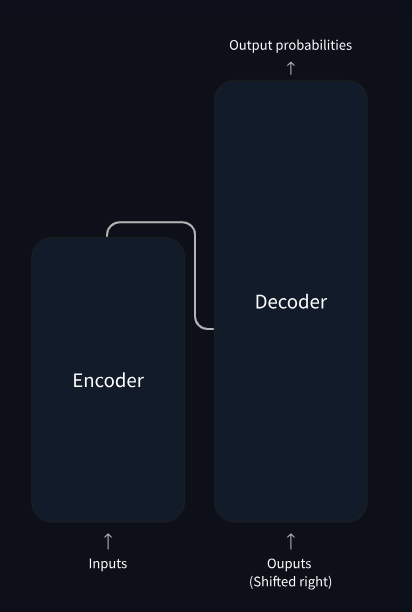

[TOC](#table-of-contents)

### 5.4. Embedding

If you want to generate text using a Transformer model you add the prompt like this one: “Data visualization empowers users to”. <br>
This input needs to be converted into a format that the model can understand and process. <br>

**Embedding**: it transforms the text into a _numerical representation_ (vector) that the model can work with. <br>

To convert a prompt into embedding, we need to

1. tokenize the input,
2. obtain token embeddings,
3. add positional information,
4. add up token and position encodings to get the final embedding.

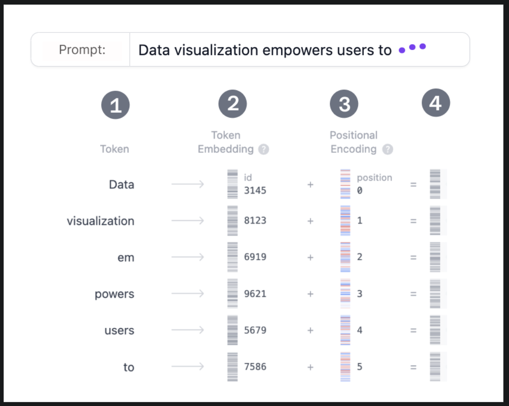
**Embedding layer view**, showing how the input prompt is converted to a vector representation. <br> The process involves (1) Tokenization, (2) Token Embedding, (3) Positional Encoding, and (4) Final Embedding.

#### 5.4.1. Step 1: Tokenization

**Tokenization** is the process of _breaking down_ the input text into smaller, more manageable pieces called $tokens$. These tokens can be a word or a subword.

EXAMPLE: The words "Data" and "visualization" correspond to unique tokens, while the word "empowers" is split into two tokens.

The full vocabulary of tokens is decided before training the model: GPT-2's vocabulary has 50,257 unique tokens. <br> Now that we split our input text into tokens with **distinct IDs**, we can obtain their **vector representation** from embeddings. <br>

[TOC](#table-of-contents)

#### 5.4.2. Step 2. Token Embedding

**GPT-2** (small) represents each token in the vocabulary as a **768-dimensional vector**; the dimension of the vector depends on the model.
<br>These embedding vectors are stored in a **matrix of shape (50,257, 768)**, containing approximately 39 million parameters! This extensive matrix allows the model to **assign semantic meaning to each token**, in the sense that tokens with similar usage or meaning in language are placed close together in this high-dimensional space, while dissimilar tokens are farther apart.

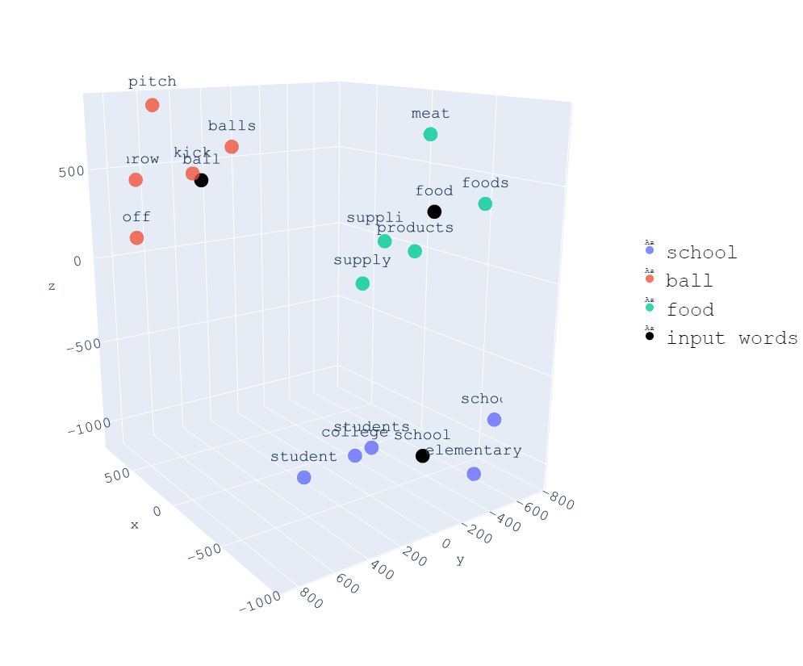

#### 5.4.3. Step 3. Positional Encoding

The Embedding layer also encodes information about each **token's position in the input prompt**. Different models use various methods for positional encoding. <br>

GPT-2 trains its own positional encoding matrix from scratch, integrating it directly into the training process.

Others use RoPE, which encodes position by rotating certain vectors.

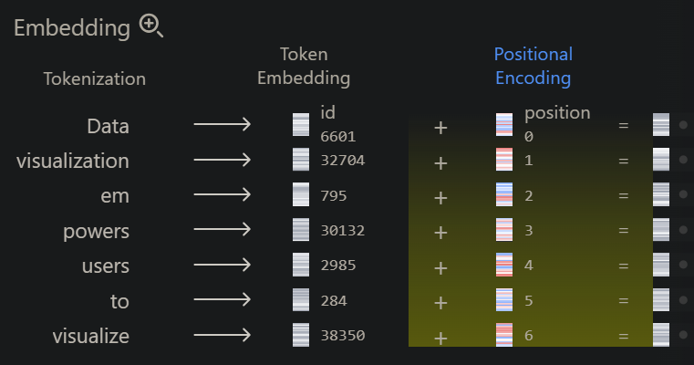

#### 5.4.4. Step 4. Final Embedding

Finally, we sum the token and positional encodings to get the final embedding representation. This combined representation captures both the semantic meaning of the tokens and their position in the input sequence.

### 5.5. Trasformer Block

The core of the Transformer's processing lies in the Transformer block, which comprises:

- multi-head self-attention
- a Multi-Layer Perceptron layer.

Most models consist of multiple such blocks that are **stacked sequentially** one after the other. The token representations evolve through layers, from the first block to the last one, allowing the model to build up an intricate understanding of each token. This layered approach leads to higher-order representations of the input.

The GPT-2 (small) model we are examining consists of 12 such blocks.

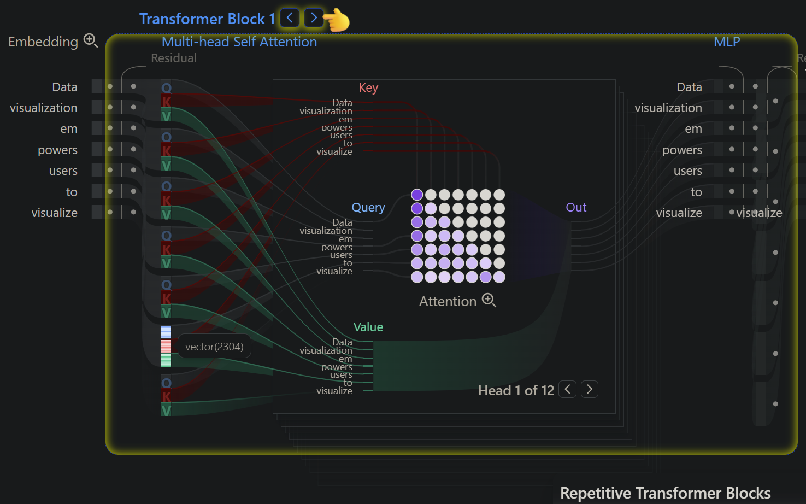

[TOC](#table-of-contents)

#### 5.5.1. Multi-Head Self-Attention

The **self-attention mechanism** enables the model to capture _relationships among tokens in a sequence_, so that each token’s representation is influenced by the others. Lets the model decide wich parts of the input are most relevant to each token.

**Multiple attention heads** allow the model to consider these _relationships from different perspectives_;

EXAMPLE: one head may capture short-range syntactic links while another tracks broader semantic context.

**STEP 1: QUERY, KEY, AND VALUE MATRICES**
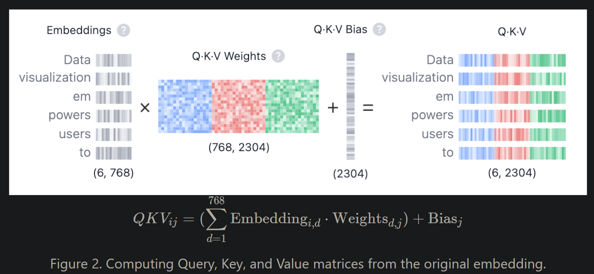

Each token's embedding vector is transformed into three vectors: <code style="color : blue">Query (Q)</code>, <code style="color : red">Key (K)</code>, and <code style="color : green">Value (V)</code>. These vectors are derived by multiplying the input embedding matrix with learned weight matrices for Q, K, and V. Here's a web search analogy to help us build some intuition behind these matrices:

- <code style="color : blue">Query (Q)</code> is the **search text** you type in the search engine bar. This is the token you want to "find more information about".

- <code style="color : red">Key (K)</code> is the **title of each web page** in the search result window. It represents the possible tokens the query can attend to.

- <code style="color : green">Value (V)</code> is the **actual content** of web pages shown. Once we matched the appropriate search term (Query) with the relevant results (Key), we want to get the content (Value) of the most relevant pages.

By using these QKV values, the model can **calculate attention scores**, which determine how much focus each token should receive when generating predictions.

**STEP 2: MULTI-HEAD SPLITTING**

<code style="color : blue">Query (Q)</code>, <code style="color : red">Key (K)</code>, and <code style="color : green">Value (V)</code> vectors are split into multiple heads—in GPT-2 (small)'s case, into 12 heads. Each head processes a segment of the embeddings independently, capturing different syntactic and semantic relationships. This design facilitates parallel learning of diverse linguistic features, enhancing the model's representational power.

**STEP 3: MASKED SELF-ATTENTION**
In each head, we perform masked self-attention calculations. This mechanism allows the model to generate sequences by focusing on relevant parts of the input while preventing access to future tokens.

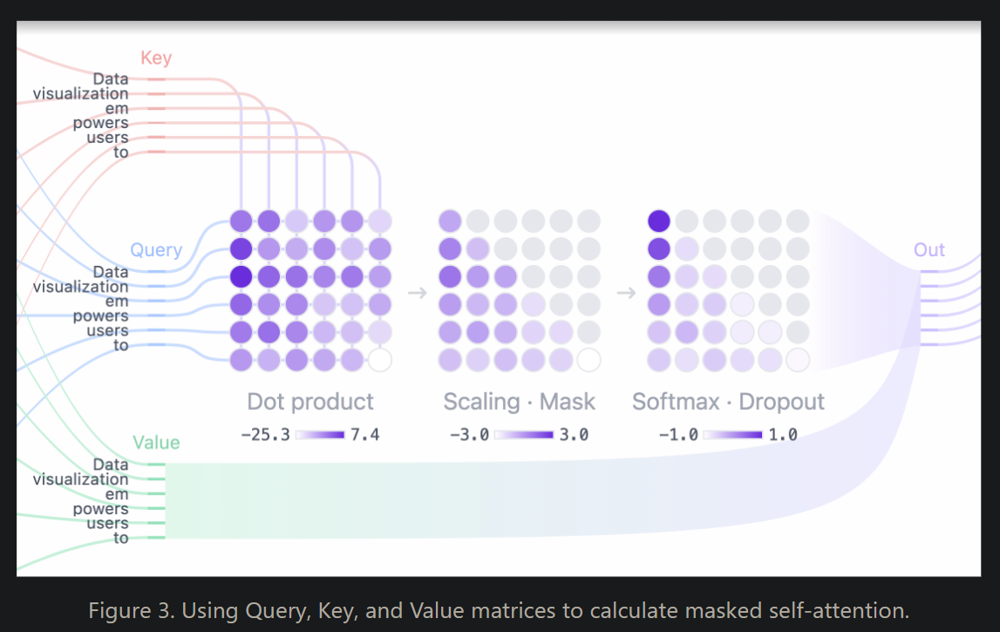

- **Dot Product:** The dot product of <code style="color : blue">Query (Q)</code>, <code style="color : red">Key (K)</code> matrices determines the _attention score_, producing a square matrix that reflects the relationship between all input tokens.

- **Scaling · Mask:** The attention scores are scaled and a mask is _applied to the upper triangle_ of the attention matrix to prevent the model from accessing future tokens, setting these values to negative infinity. The model needs to learn how to predict the next token without “peeking” into the future.

- **Softmax · Dropout:** After masking and scaling, the attention scores are _converted into probabilities_ by the softmax operation, then optionally regularized with dropout. Each row of the matrix sums to one and indicates the relevance of every other token to the left of it.

**STEP 4: OUTPUT AND CONCATENATION**
The model uses the masked self-attention scores and multiplies them with the <code style="color : green">Value</code> matrix to get the final output of the self-attention mechanism.

GPT-2 has 12 self-attention heads, each capturing different relationships between tokens.

The outputs of these heads are concatenated and passed through a linear projection.

[TOC](#table-of-contents)

#### 5.5.2. Attention mechanisms

Most transformer models use full attention in the sense that the attention matrix is square. It can be a big **computational bottleneck** when you have long texts.

**Standard attention mechanisms** have a computational complexity of **O(n²)**, where n is the sequence length.

**Longformer** and **reformer** are models that try to be more efficient and use a sparse version of the attention matrix to speed up training.

**LSH ATTENTION - Reformer** <br>
Reformer uses LSH attention.

In the softmax(QK^t), only the biggest elements (in the softmax dimension) of the matrix QK^t are going to give useful contributions.

So for each query q in Q, we can consider only the keys k in K that are close to q. A hash function is used to determine if q and k are close. The attention mask is modified to mask the current token (except at the first position), because it will give a query and a key equal (so very similar to each other). Since the hash can be a bit random, several hash functions are used in practice (determined by a n_rounds parameter) and then are averaged together.

**LOCAL ATTENTION - Longformer** <br>
Longformer uses local attention: often, the local context (e.g., what are the two tokens to the left and right?) is enough to take action for a given token. Also, by stacking attention layers that have a small window, the last layer will have a receptive field of more than just the tokens in the window, allowing them to build a representation of the whole sentence.

Some preselected input tokens are also given global attention: for those few tokens, the attention matrix can access all tokens and this process is symmetric: all other tokens have access to those specific tokens (on top of the ones in their local window). This is shown in Figure 2d of the paper, see below for a sample attention mask:

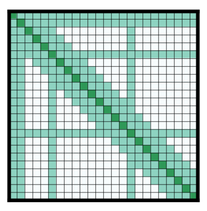

#### 5.5.3. MLP: Multi-Layer Perceptron

Then the concatenated outputs are passed through the **Multilayer Perceptron (MLP) layer** to enhance the model's representational capacity. The MLP block consists of **two linear transformations** with a _GELU activation_ function in between.

The **first linear transformation** _expands the dimensionality_ of the input four-fold from 768 to 3072.

- Allows the model to project the token representations into a higher-dimensional space,
- it can capture richer and more complex patterns that may not be visible in the original dimension.

The **second linear transformation** then _reduces the dimensionality_ back to the original size of 768.

- brings the representations back to a manageable size
- while retaining the useful nonlinear transformations introduced in the expansion step.

Unlike the self-attention mechanism, which integrates information across tokens, the **MLP** processes tokens independently and simply **maps** each token representation from one space to another, enriching the overall model capacity.

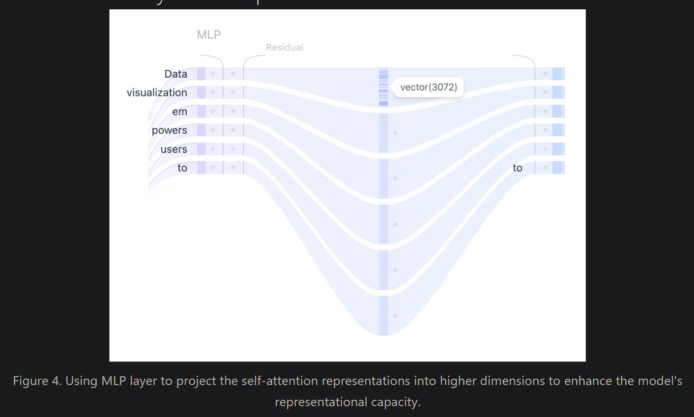

[TOC](#table-of-contents)

### 5.6. Output Probabilities

After the input has been processed through all Transformer blocks, the output is passed through the final linear layer to prepare it for **token prediction**.

This layer projects the final representations into a 50,257 dimensional space, where every token in the vocabulary has a corresponding value called logit. Any token can be the next word, so this process allows us to simply **rank** these tokens by their _likelihood of being that next word_.

We then apply the **softmax function** to convert the logits into a probability distribution that sums to one. This will allow us to sample the next token based on its likelihood.

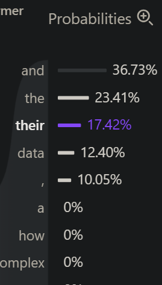

#### 5.6.1. Sampling

The final step is to generate the next token by sampling from this distribution.


**Raw Logits**: Think of these as the model’s initial gut feelings about each possible next word

The **temperature hyperparameter** plays a critical role in this process. Model output logits are simply divided by the temperature:

- **temperature = 1**: Dividing logits by one has no effect on the softmax outputs.
- **temperature < 1**: Lower temperature makes the model more confident and deterministic by sharpening the probability distribution, leading to more predictable outputs.
- **temperature > 1**: Higher temperature creates a softer probability distribution, allowing for more randomness in the generated text – model “creativity”.

In addition, the **sampling process** can be further refined using top-k and top-p parameters:

- **top-k sampling**: Limits the candidate tokens to the top k tokens with the highest probabilities, filtering out less likely options (eg 90%).
- **top-p sampling**: Considers the smallest set of tokens whose cumulative probability exceeds a threshold p, ensuring that only the most likely tokens contribute while still allowing for diversity.

By tuning temperature, top-k, and top-p, you can balance between deterministic and diverse outputs, tailoring the model's behavior to your specific needs.

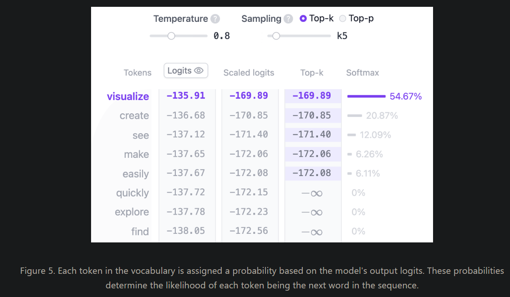

[TOC](#table-of-contents)

#### 5.6.2. Managing Repetition: Keeping Output Fresh

One common challenge with LLMs is their tendency to **repeat themselves**. To address this, we use two types of _penalties_:

- **Presence Penalty**: A fixed penalty applied to any token that has appeared before, regardless of how often. This helps prevent the model from reusing the same words.

- **Frequency Penalty**: A scaling penalty that increases based on how often a token has been used. The more a word appears, the less likely it is to be chosen again.

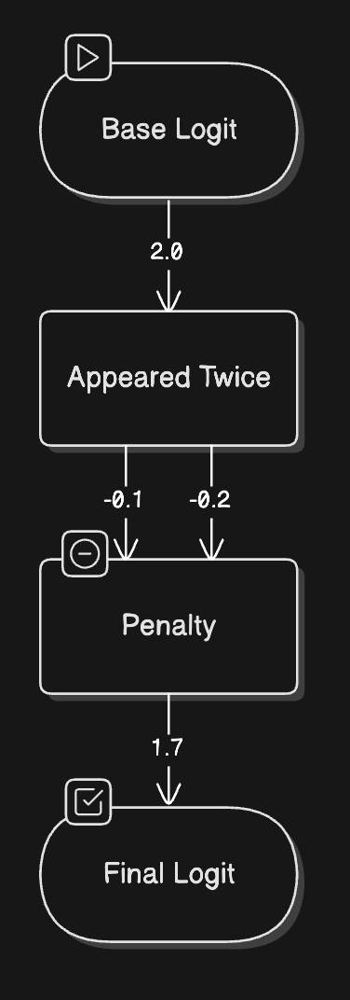

These penalties are applied early in the token selection process, adjusting the raw probabilities before other sampling strategies are applied. Think of them as gentle nudges encouraging the model to explore new vocabulary.

#### 5.6.3. Controlling Generation Length: Setting Boundaries

Just as a good story needs proper pacing and length, we need ways to control how much text our LLM generates. This is crucial for practical applications - whether we’re generating a tweet-length response or a full blog post.

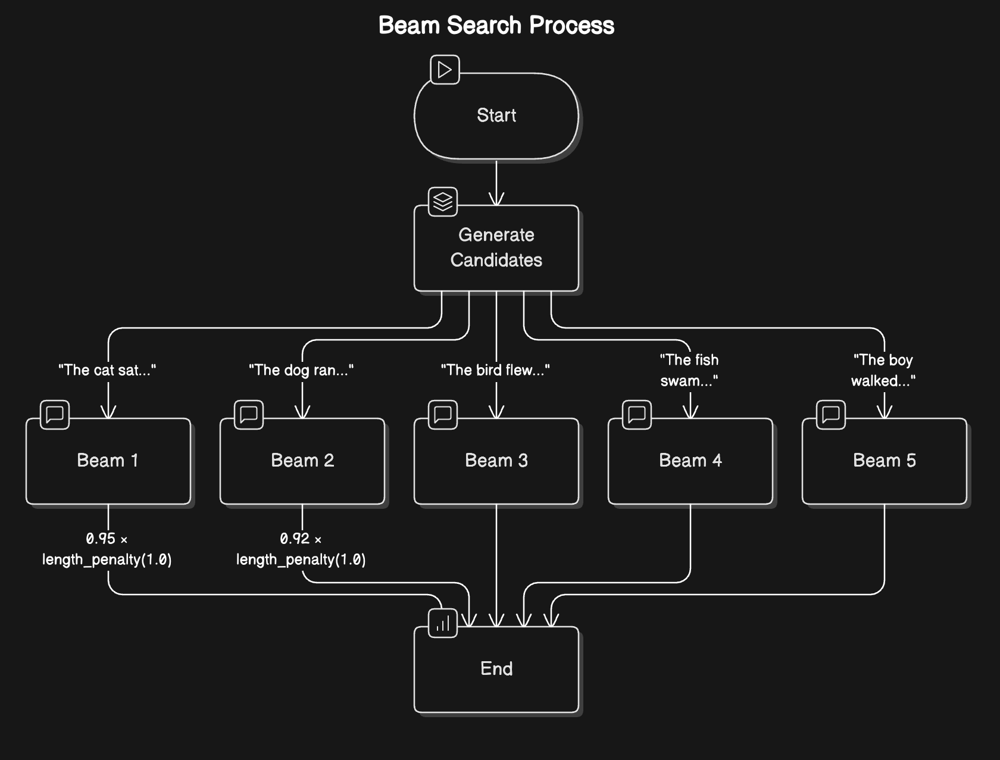

We can control generation length in several ways:

- **Token Limits**: Setting minimum and maximum token counts
- **Stop Sequences**: Defining specific patterns that signal the end of generation
- **End-of-Sequence Detection**: Letting the model naturally conclude its response

For example, if we want to generate a single paragraph, we might set a maximum of 100 tokens and use “\n\n” as a stop sequence. This ensures our output stays focused and appropriately sized for its purpose.

[TOC](#table-of-contents)

#### 5.6.4. Beam Search: Looking Ahead for Better Coherence

While the strategies we’ve discussed so far make decisions one token at a time, beam search takes a more holistic approach. Instead of committing to a single choice at each step, it explores multiple possible paths simultaneously - like a chess player thinking several moves ahead.

Here’s how it works:

1. At each step, maintain multiple candidate sequences (typically 5-10)
2. For each candidate, compute probabilities for the next token
3. Keep only the most promising combinations of sequences and next tokens
4. Continue this process until reaching the desired length or stop condition
5. Select the sequence with the highest overall probability

This approach often produces more coherent and grammatically correct text, though it requires more computational resources than simpler methods.

### 5.7. The original architecture

The Transformer architecture was originally designed for **translation**.

During training:

**ENCODER**:

1. receives **inputs** sentences in a certain language (text)
2. **Embedding** → transforms tokens into vectors
3. **Positional Encoding** → adds to each embedding the position of it in the sentence (the model knows who comes first and who comes next)
4. **Self-Attention** → use all the words in a sentence to capture the dependencies between the different positions whithin the sequence (since the translation of a given word can be dependent on what is after/before)
5. **Feed-Forward** → reprocesses the information token by token

**Output:** a contextualized representation of the input

**DECODER**

1. **Input 1**: the target language (shifted right) -> so that at each position the model predicts the next token
1. **Embedding + Positional Encoding** of tokens already generated
1. **Masked Self-Attention** → prevents the model from seeing the future tokens by focusing on past parts of the sequence (already generated tokens). To predict the fourth word, the attention layer will only have access to the words in positions 1 to 3.
1. **Input 2**: output of the encoder.
1. **Attention on the Encoder** → focus on the relevant parts of the input while generating the current token.
1. **Feed-Forward**
1. **Softmax** → predicts the next token

**Output**: the generated sequence.

**Multi-Head Attention**
Not just one type of attention, but several types of attention in parallel:

- one can capture syntactic relationships
- another can capture semantic relationships
- yet another can capture grammatical agreements

**Encoder** = understands the input and builds a contextual representation of the input.<br>
**Decoder** = generates the output autoregressively, using past outputs and the encoder’s representation.

The original architecture looks like:

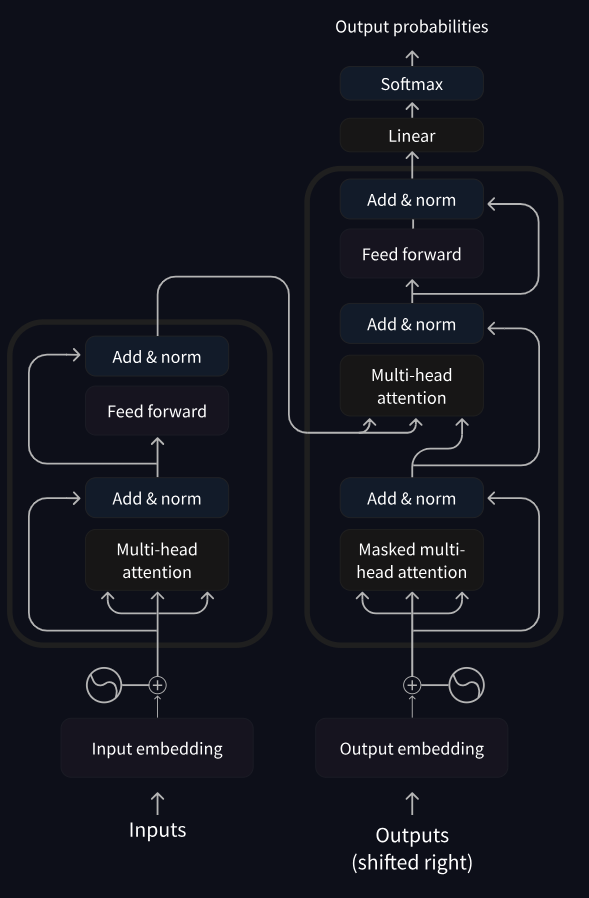

[TOC](#table-of-contents)

### 5.8. Practical Challenges and Optimization

As we wrap up our exploration of LLM inference, let’s look at the practical challenges you’ll face when deploying these models, and how to measure and optimize their performance.

#### 5.8.1. Key Performance Metrics

When working with LLMs, four critical metrics will shape your implementation decisions:

1. **Time to First Token (TTFT):** How quickly can you get the first response? This is crucial for user experience and is primarily affected by the prefill phase.

2. **Time Per Output Token (TPOT):** How fast can you generate subsequent tokens? This determines the overall generation speed.

3. **Throughput:** How many requests can you handle simultaneously? This affects scaling and cost efficiency.

4. **VRAM Usage:** How much GPU memory do you need? This often becomes the primary constraint in real-world applications.

#### 5.8.2. The Context Length Challenge

One of the most significant challenges in LLM inference is managing context length effectively. Longer contexts provide more information but come with substantial costs:

- **Memory Usage:** Grows quadratically with context length
- **Processing Speed:** Decreases linearly with longer contexts
- **Resource Allocation:** Requires careful balancing of VRAM usage

Recent models like Qwen2.5-1M offer impressive 1M token context windows, but this comes at the cost of significantly slower inference times. The key is finding the right balance for your specific use case.

[TOC](#table-of-contents)

#### 5.8.3. The KV Cache Optimization

To address these challenges, one of the most powerful optimizations is KV (Key-Value) caching. This technique significantly improves inference speed by storing and reusing intermediate calculations. This optimization:

- Reduces repeated calculations
- Improves generation speed
- Makes long-context generation practical

The trade-off is additional memory usage, but the performance benefits usually far outweigh this cost.

### 5.9. Types of Language Models

In the Transformers library, language models generally fall into three architectural categories, depending on the task:

- **Encoder-only models:** (BERT)

  - Good for tasks that require understanding of the input
  - sentence classification and named entity recognition.
  - the attention layers can access all the words in the initial sentence.
  - These models use a bidirectional approach to understand context from both directions

- **Decoder-only models:** (GPT, Llama)
  - Good for generative tasks such as text generation.
  - These models process text from left to right
  - text generation tasks.
  - They can complete sentences, write essays, or even generate code based on a prompt.
  - At each stage, for a given word the attention layers can only access the words positioned before it in the sentence
  - predicting the next word in the sentence.
- **Encoder-decoder models** or sequence-to-sequence models: (T5, BART)
  - Good for generative tasks that require an input, such as translation or summarization.
  - These models combine both approaches, using an encoder to understand the input and a decoder to generate output.

There are two main approaches for training a transformer model:

- **Masked language modeling (MLM)**: Used by encoder models like BERT, this approach randomly masks some tokens in the input and trains the model to predict the original tokens based on the surrounding context. This allows the model to learn bidirectional context (looking at words both before and after the masked word).

- **Causal language modeling (CLM)**: Used by decoder models like GPT, this approach predicts the next token based on all previous tokens in the sequence. The model can only use context from the left (previous tokens) to predict the next token.

[TOC](#table-of-contents)

### 5.10. How Transformers solve tasks

TODO:
https://huggingface.co/learn/llm-course/chapter1/5

### 5.11. BERT

TODO?

### 5.12. Modern Large Language Models (LLMs)

GPT, LLAMA

Most modern Large Language Models (LLMs) use the **decoder-only architecture**.

Modern LLMs are typically **trained in two phases**:

1. **Pretraining**: The model learns to predict the next token on vast amounts of text data

2. **Instruction tuning**: The model is _fine-tuned_ to follow instructions and generate helpful responses
   This approach has led to models that can understand and generate human-like text across a wide range of topics and tasks.

Modern decoder-based LLMs have demonstrated impressive capabilities: Text generation, Summarization, Translation, Question answering, Code generation, Reasoning, Few-shot learning.

[TOC](#table-of-contents)

### 5.13. Sequence-to-sequence models

BART, T5

**Encoder-decoder models** (also called sequence-to-sequence models) use both parts of the Transformer architecture.

At each stage, the attention layers of the encoder can access all the words in the initial sentence, whereas the attention layers of the decoder can only access the words positioned before a given word in the input.

The **pretraining** of these models involves _reconstructing a sentence_ for which the input has been somehow corrupted (for instance by masking random words).

The pretraining of the T5 model consists of replacing random spans of text (that can contain several words) with a single mask special token, and the task is then to predict the text that this mask token replaces.

Sequence-to-sequence models are best suited for tasks revolving around **generating new sentences depending on a given input** (preserving the meaning).

Some practical applications include: Machine translation,
Text summarization, Data-to-text generation, Grammar correction and Question answering.
